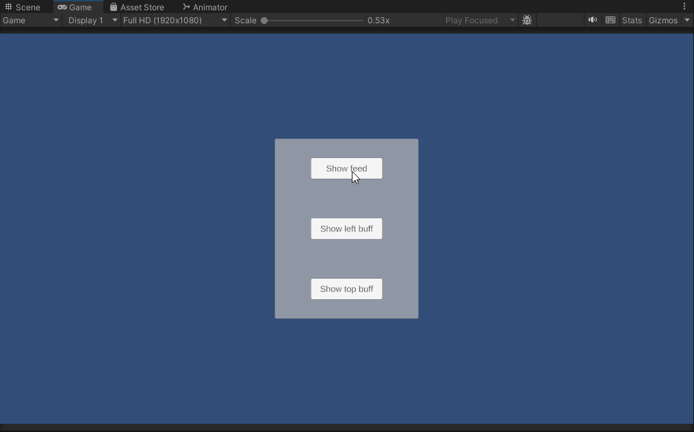

   # SmoothLayoutToolkit

   A Unity toolkit that provides smooth animated layout transitions for UI elements. Instead of instant
    repositioning, child elements glide to their new positions with configurable animation speed.

   ## ✨ Features

   - VerticalSmoothLayout — Vertical layout group with smooth animated transitions
   - HorizontalSmoothLayout — Horizontal layout group with smooth animated transitions
   - Pool-based message feeds — Ready-to-use components for notifications, buff timers, and similar UI patterns
   - Configurable — Animation speed, spacing, padding, and layout direction via Inspector
   - Lightweight — No external dependencies besides Unity (DOTween used in demo examples)

   ## 🎮 Demo Scene
   
   
  #### The package includes a demo scene showcasing all layout types:
  - Message feed with text and icons
  - Vertical buff feed with countdown timers
  - Horizontal buff feed with countdown timers
     
  ##  📦 Installation

  #### Manual
   1. Download or clone this repository
   2. Copy the Assets/SmoothLayout folder into your Unity project's Assets folder

  #### UnityPackage
  1. Download the latest .unitypackage from the [Releases](https://github.com/ForsakenAginor/SmoothLayoutToolkit/releases) page and import it into your project.
  2. Import package to your project
      
  Open the demo scene to see everything in action!

   ## 📝 Requirements
  - TextMeshPro (included with Unity)
  - DOTween (optional, only for feed animations — demo examples)
